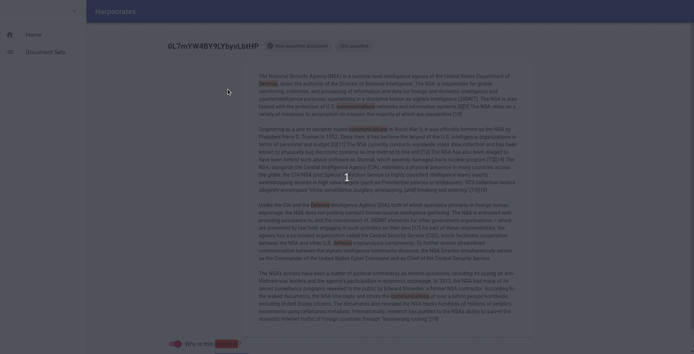

# Harpocrates




This is the mono-repository for the Harpocrates sensitive document redaction application. Harpocrates is a web application to aid in the redaction of collections of sensitive by using Machine Learn (scikit-learn) to classify documents according to sensitivity and explaining these classifications (LIME).

Harpocrates' interface not only allows redactors to visualize the Machine Learning classifications with their explanations but also to redact the uploaded documents.

## How to run

To run the Harpocrates stack, you will need:

- docker
- docker-compose

```bash
git clone https://gitlab.com/harpocrates-app/harpocrates.git
cd harpocrates
docker-compose up -d
```

## Development

The development Logbook of Harpocrates can be [found here](https://dissertation.guillaume.desusanne.com).

### How it works

Harpocrates uses the following tech stack:

- MongoDB (Document store)
- Flask (backend API)
- ReactJS (Frontend)

### Develop locally (without docker)

To run the stack without docker you will need to have:

- python 3.7
- pipenv
- node 13.1

1. Clone the repository
   - ```bash
     git clone https://gitlab.com/harpocrates-app/harpocrates.git
     cd harpocrates
     cat hosts.txt >> /etc/hosts
     ```
2. Create and install backend API environment and run API
   - ```bash
     cd api
     pipenv install
     pipenv shell
     flask run --port 80
     ```
3. Create and install frontend Node environment and run development build of frontend
   - ```bash
     cd frontend
     npm install
     npm run dev
     ```
4. Run a MongoDB instance (you can use the one define in the docker-compose `docker-compose up -d mongo`)
