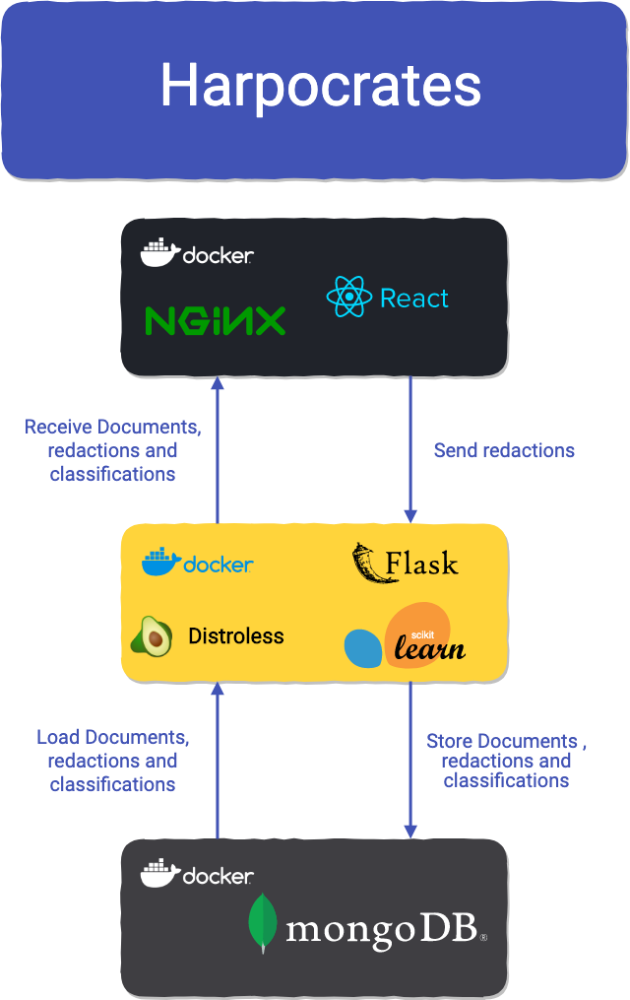

<div align="center">
  
</div>

<div align="center"><h1>Harpocrates</h1></div>

<div align="center">
  
  <a href="https://codecov.io/gh/guillaumedsde/Harpocrates">
    
  </a>
  <a href="https://harpocrates-app.gitlab.io/harpocrates/">
    
  </a>
  <a href="https://deepscan.io/dashboard#view=project&tid=7077&pid=9224&bid=117107">
    
  </a>
  <a href="https://deepsource.io/gh/guillaumedsde/Harpocrates/?ref=repository-badge">
    
  </a>
  <!--  -->
  <!--  -->
  <a href="https://app.fossa.com/reports/f5f2f0d3-8d62-4141-922d-d9a72ce66260" alt="FOSSA report">
    
  </a>
  <a href="https://github.com/guillaumedsde/Harpocrates/blob/master/LICENSE.md">
    
  </a>
</div>

<br/>

<div align="center">
  This work is part of my <a href="https://harpocrates-app.gitlab.io/dissertation/dissertation.pdf">📝 final year dissertation</a> at the University of Glasgow
</div>

<br/>

<div align="center">
  This is the mono-repository for the Harpocrates <b>sensitive document redaction</b> Proof of Concept application. Harpocrates is a Web Application for redacting sensitive documents with Machine Learning (ML) classification of documents by sensitivity as part of my final year project. It is a <a href="https://github.com/facebook/react">ReactJS</a> frontend backed by an <a href="https://github.com/OAI/OpenAPI-Specification">OpenAPI</a> generated <a href="https://github.com/pallets/flask">Flask API</a> with a <a href="https://github.com/scikit-learn/scikit-learn">Scikit-learn ML model</a> to classify text documents stored in <a href="https://github.com/mongodb/mongo">MongoDB</a>. I am using <a href="https://github.com/marcotcr/lime">Lime</a> to extract features explaining the ML classification and to present a classification aid with its explanation to redactors in a friendly redaction web app.
</div>
<br/>

<div align="center">
  
</div>

## Project Overview

<div align="center">
<a href="https://www.youtube.com/watch?feature=player_embedded&v=-C3zsvscaKI
" target="_blank"></a>
</div>

## How to run

To run the Harpocrates stack, you will need:

- docker
- docker-compose

```bash
git clone https://gitlab.com/harpocrates-app/harpocrates.git
cd harpocrates
docker-compose up -d
```

### Prebuilt docker images

A Docker image repository with prebuilt docker images is also [available here](https://gitlab.com/harpocrates-app/harpocrates/container_registry)

## Documentation

Documentation for Harpocrates services is available here: [https://harpocrates-app.gitlab.io/harpocrates](https://harpocrates-app.gitlab.io/harpocrates)

## Development

The development Logbook of Harpocrates can be [found here](https://dissertation.guillaume.desusanne.com).

### Tech stack

<div align="center">
  
</div>

### Develop locally (without docker)

To run the stack without docker you will need to have:

- Python 3.7.x
- NodeJS 13.x
- MongoDB 4.2.x

#### Clone the repository

```bash
git clone https://gitlab.com/harpocrates-app/harpocrates.git
cd harpocrates
cat hosts.txt >> /etc/hosts
```

#### Create and install backend API environment and run API

```bash
cd api
pip install --user pipenv
pipenv install
pipenv shell
flask run --port 80
```

#### Create and install frontend Node environment and run development build of frontend

```bash
cd frontend
npm install
npm run dev
```

#### Run a MongoDB instance

you can use the one define in the docker-compose :

```bash
docker-compose up -d mongo
```

### Generate the Javascript API Client code

The `js-api-client` service is a Node package auto-generated using the openapi-generator from the specification defined in `api-sepecification/api-specification/openapi.yml`.

To update the JS client after having modified the specification use the following command at the repo's root **after having installed the [OpenAPI code generator](https://github.com/OpenAPITools/openapi-generator)**:

```bash
make api-client
```

### Generate the Flask API Server code

The Flask API server code is also derived from the OpenAPI generator code, however, some files are protected from "auto generation overwrite" this list is in `api/.openapi-generator-ignore`. As such, some manual modification of these files might be required after code generation which is run from the project root with the following command **after having installed the [OpenAPI code generator](https://github.com/OpenAPITools/openapi-generator)**:

```bash
make api-server
```
